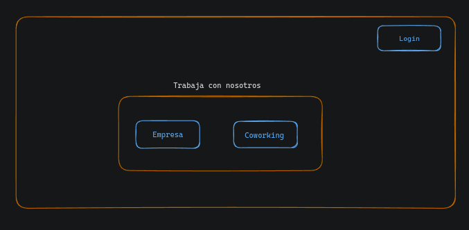
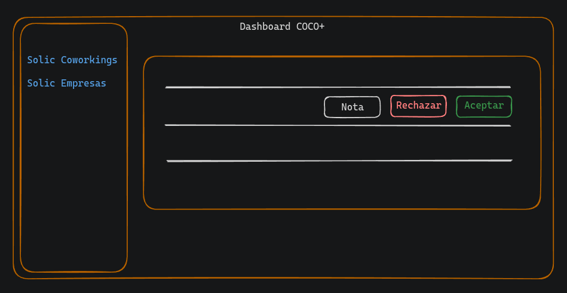

# Proyecto COCO+

## Gestión de usuarios

Inicialmente la aplicación solo posee el user **_superadmin_** (coco+).

Los **_coworkings_** y **_empresas_** que desean trabajar con la app disponen de formularios de contacto en la landing page.

La landing page también posee la opción signin para usuarios que ya se encuentran registrados, y <mark>no existe la opción de realizar el signup desde la landing page.</mark>

### Formularios de contacto

- Coworking

  - contact name
  - contact lastnane
  - contact phone
  - contact email
  - contact identification (DNI)
  - coworking name
  - coworking address
  - coworking email
  - coworking phone
  - coworking web
  - coworking open (horario de apertura)
  - coworking close (horario de cierre)
  - coworking spaces
  - Message

- Company
  - contact name
  - contact lastnane
  - contact phone
  - contact email
  - contact identification (DNI)
  - contact role (cargo dentro de la empresa)
  - company name
  - company quantity_beneficiaries (cantidad aproximada de empleados con el beneficio)
  - company business_sector
  - company size (1-50, 50-100, ...) (tamaño de la empresa)
  - Message

### endpoints y entidades para solicitudes

- POST requests/coworking
- POST requests/company

Podemos generar dos entidades **_requests_coworking_** y **_requests_company_** <mark>(o solo una agregando un campo type para diferenciar el origen de la solicitud)</mark>. Además contarán con un campo status (pending, close), request_date y observación.

El campo status se utilizará para reflejar si el superadmin ya proceso la novedad (close) y si aún se encuentra en contacto (pending)

## Incorporación de Coworkings y empresas

El **dashboard del superadmin** tendrá las opciones para trabajar sobre las solicitudes.

### Coworkings

En el momento en que el superadmin acepta una solicitud de coworking, utilizando la información de la solicitud, se creará un <mark>**usuario con role adminCoworking**</mark> y se insertará un registro en la entidad Coworkings con <mark>status pending</mark>.

- Creamos user (adminCoworking)
- Creamos el coworking (status pending)
- Establecemos la relación entre las entidades user y coworking.
- Enviamos el email al adminCoworking informando que puede iniciar sesión en la App con las credenciales (password generada aleatorimente).

El estado pendiente (coworkings) se debe a que debe completar los datos del coworking (thumbnail, amenities, imágenes, etc) antes de pasar a active.

- Estados del coworking
  - Pending -> aún no se encuentra configurado
  - Active -> configurado y disponible para realizar reservas
  - Block -> <mark>el superadmin podrá suspender / rehabilitar un coworking?</mark>
  - Inactive -> baja del coworking

El estado de Active a Block y viceversa solo lo podrá realizar el superadmin.
<mark>**De pendiente a activo requiere aprobación del superadmin?**</mark>

- Entidad coworkings

  - id (UUID autogenerado)
  - name
  - email
  - phone
  - spaces
  - open
  - close
  - address
  - <mark>lat</mark> **(cómo se calcula?)**
  - <mark>long</mark> **(cómo se calcula?)**
  - thumbnail
  - status

- Entidad users
  - id (UUID autogenerado)
  - name
  - lastname
  - identification
  - email
  - password
  - activation_date
  - recovery_token
  - role

Más adelante veremos la configuración del coworking y sus relaciones (amenities, images, etc)

### Empresas

En el momento en que el superadmin acepta una solicitud de empresa, utilizando la información de la solicitud, se creará un <mark>**usuario con role adminCompany**</mark>, se insertará un registro en la entidad **employee** y se insertará el registro en la entidad **company**.

- Entidad companies

  - id (UUID autogenerado)
  - name
  - quantity_beneficiaries
  - business_sector
  - size
  - status

- Entidad employee
  - id (UUID autogenerado)
  - position (cargo)
  - passes (cantida de pases asignada mensualmente)
  - available_passes (cantidad de pases disponibles)
  - status (active, block, inactive)
  - company_id
  - user_id

## Pendientes

- Cambios de estados en las distintas entidades
- Información adicional como cuenta bancaria del coworking donde realizar los pagos por parte de Coco+ por los servicios utilizados (mencionado en la reunión del 03/05)

### Primer acceso de usuarios (login)

Dentro de la entidad **users** dejamos el campo <mark>**activation_date**</mark> para gestionar el cambio de contraseña en el primer inicio de sesión.

Cuando se crea el usuario se genera con un password aleatorio de 8 dígitos y activation_date en null. El password temporal se enviará al usurio por email.

Desde el front, cuando el usuario realce el primer inicio de sesión se verificará si el campo activation_date se encuentra en nulo para redigirlo a la pantalla de cambio de contraseña.

Al realizar el cambio de contraseña se completará el campo con la fecha actual. De esta manera, en posteriores inicios de sesión accederá directamnte a su dashboard.
